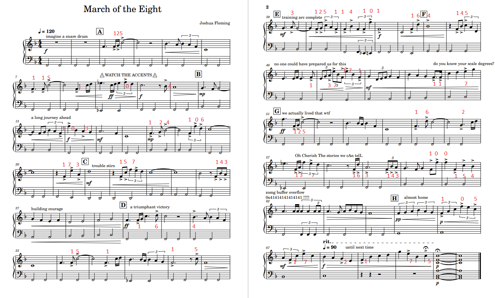
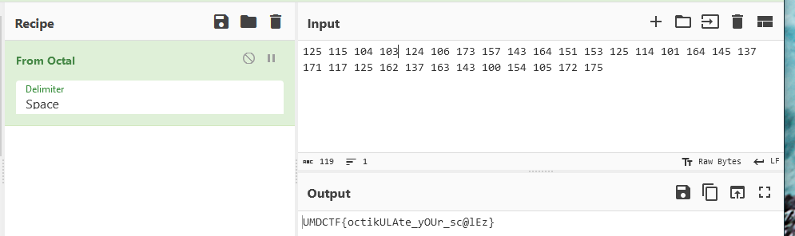

# March of the Eight

I've played so many JRPGs that I decided to make my own! Someone told me you need to start with the music first...
oooh, and hide easter eggs in your work!

(note: the mp3 is just for listening)

## Build Instructions

n/a

## Files for CTFd

- [MarchOfTheEight.pdf](MarchOfTheEight.pdf)
- [MarchOfTheEight.mp3](MarchOfTheEight.mp3)

## Flag

`UMDCTF{octikULAte_yOUr_sc@lEz}`

## Writeup

The music composition has a single flat in its key signature, and given that the song starts with a low F bass note,
we deduce that the song's key is likely F major.

Looking through the music, we see a lot of text written around. Some of the phrases that particularly stick out
include "WATCH THE ACCENTS", "do you know your scale degrees?", and "Oh Cherish The stories we cAn telL". From the
last phrase, we notice certain characters capitalized - this spells OCTAL. A bit of googling "scale degree" we learn
that for a given musical scale, each note has a certain degree: "the position of a particular note relative
to...the first and main note of the scale" (Wikipedia).

Degrees of a scale can be identified by ordinal numbers, such as 1, 2, 3, etc. In the F major scale, this corresponds
to the following assignment:
- F: 1st degree
- G: 2nd degree
- A: 3rd degree
- Bb: 4th degree
- C: 5th degree
- D: 6th degree
- E: 7th degree
- F: 1st degree (loops back to 1st)

Given this, and the hint OCTAL, the flag is probably encoded as some of the notes' scale degrees interpreted as octal.
Which characters are the ones we're supposed to check? The first hint tells us very explosively that we should watch
the accented notes. These are notes with a `>` aligned directly above/below the note, used to mark notes that would
be accented a bit more when playing.

If we note down the scale degrees to each of the notes in order of the song, using the high F as 0, we can notice
that the first few sets of numbers translate to `UM...` - further processing will yield the flag.

